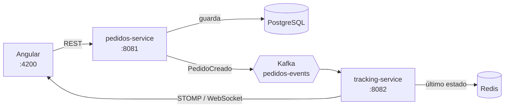

# OrderTracker-Stream — Rastreo de Pedidos en Tiempo Real


> [!NOTE]
> **Estado del proyecto: en desarrollo (Sprint 0 completado).** Los esqueletos de los tres proyectos están creados y el repositorio está configurado. La lógica de negocio, la mensajería y el tiempo real se irán implementando por sprints (ver [Plan de desarrollo](#️-plan-de-desarrollo)).

---

## 📌 Sobre el proyecto

**OrderTracker-Stream** es un proyecto personal full-stack para practicar una arquitectura **orientada a eventos** con microservicios. El usuario crea un pedido desde la web y puede seguir su estado y posición **en vivo**, sin recargar la página ni hacer polling.

El objetivo no es solo que funcione, sino poder **defender las decisiones de diseño**: por qué dos servicios separados, por qué Kafka, cómo se garantiza el orden de los eventos y qué pasa si llega un evento duplicado o el cliente pierde la conexión.

El proyecto está estructurado como un **monorepo** con tres aplicaciones independientes:

- **`pedidos-service` (Spring Boot)**: API REST para crear y consultar pedidos. Los guarda en PostgreSQL y publica un evento en Kafka. No sabe nada de tracking ni de WebSockets: su única responsabilidad es el ciclo de vida del pedido.
- **`tracking-service` (Spring Boot)**: consume los eventos de Kafka, mantiene el último estado de cada pedido en Redis, simula el movimiento del repartidor y emite las actualizaciones por WebSocket.
- **`frontend` (Angular)**: crea pedidos, muestra el historial y visualiza el seguimiento en vivo.

---

## 🔍 Arquitectura



### Flujo de extremo a extremo

1. El usuario crea un pedido en Angular → `POST` a `pedidos-service`.
2. `pedidos-service` lo guarda en PostgreSQL y publica el evento `PEDIDO_CREADO` en el topic `pedidos-events`.
3. `tracking-service` consume el evento, inicializa el estado (`CONFIRMADO`) y lo guarda en Redis.
4. Un simulador genera actualizaciones periódicas de posición y estado (`EN_CAMINO` → `ENTREGADO`).
5. Cada actualización se emite por WebSocket al canal `/topic/pedidos/{pedidoId}`.
6. Angular recibe el mensaje por STOMP y actualiza la interfaz al instante.

### Contratos de eventos

| Evento | Topic / canal | Campos |
|---|---|---|
| `PedidoCreado` | Kafka `pedidos-events` | `pedidoId`, `clienteId`, `direccionOrigen`, `direccionDestino`, `timestamp`, `tipo` |
| `TrackingActualizado` | WebSocket `/topic/pedidos/{pedidoId}` | `pedidoId`, `estado` (`CONFIRMADO` / `EN_CAMINO` / `ENTREGADO`), `lat`, `lng`, `timestamp` |

---

## 🔧 Tecnologías utilizadas

| Capa | Tecnología | Para qué se usa |
|---|---|---|
| Frontend | **Angular 21** + SCSS | Interfaz, routing y cliente de tiempo real |
| Tiempo real (cliente) | **@stomp/stompjs** + **sockjs-client** | Suscripción a los canales STOMP del servidor |
| Backend | **Spring Boot 4.1** (Java 21) | Los dos microservicios |
| Mensajería | **Apache Kafka** (modo KRaft) | Eventos entre servicios |
| Estado en vivo | **Redis** | Último estado conocido de cada pedido |
| Base de datos | **PostgreSQL** | Persistencia de pedidos |
| Infraestructura | **Docker Compose** | Levantar Kafka, Redis y PostgreSQL en local |
| Gestión de proyecto | **Maven**, **Git** (Conventional Commits) | Build y control de versiones |

### Dependencias de Spring Boot

| Servicio | Dependencias |
|---|---|
| `pedidos-service` | Spring Web, Spring Data JPA, PostgreSQL Driver, Spring for Apache Kafka, Validation, Actuator, Lombok |
| `tracking-service` | Spring Web, Spring for Apache Kafka, Spring Data Redis, WebSocket, Actuator, Lombok |

---

## 🤔 Decisiones de diseño

* **Dos servicios en lugar de uno.** `pedidos-service` y `tracking-service` tienen responsabilidades y cargas distintas: uno gestiona el ciclo de vida del pedido y el otro el flujo en tiempo real. Separarlos permite escalarlos de forma independiente y mantener cada uno simple (*single responsibility*).
* **Particionado por `pedidoId`.** El topic `pedidos-events` usa 3 particiones con `pedidoId` como clave, de modo que todos los eventos de un mismo pedido van a la misma partición y se procesan **en orden**. Con una partición aleatoria podrían llegar desordenados.
* **Consumer group.** `tracking-service-group` permite que, al escalar a varias instancias, Kafka reparta las particiones automáticamente.
* **Idempotencia del consumidor.** Kafka puede entregar un mensaje más de una vez. El consumidor está diseñado para que procesar el mismo evento dos veces no cambie el resultado (actualizar estado en lugar de acumularlo, con `pedidoId` + tipo de evento como clave de deduplicación).
* **Reconexión de WebSocket.** Si el cliente pierde la conexión, al reconectar se suscribe al canal y pide el último estado conocido (guardado en Redis) para no perder ninguna actualización.

> [!NOTE]
> Limitación conocida: guardar en PostgreSQL y publicar en Kafka son dos operaciones no atómicas. Si Kafka falla justo después de guardar, el pedido queda sin evento. La solución habitual es el patrón *Outbox*; queda documentada como mejora futura.

---

## 🗂️ Estructura del repositorio

```
OrderTracker-Stream/
├── frontend/             # Angular 21 (SCSS, routing, sin SSR)
│   └── src/app/          # pedidos/, tracking/, shared/
├── pedidos-service/      # Spring Boot — API REST + productor Kafka
│   └── src/main/java/com/portfolio/pedidos/
├── tracking-service/     # Spring Boot — consumidor Kafka, Redis, WebSocket
│   └── src/main/java/com/portfolio/tracking/
├── docker-compose.yml    # (pendiente) PostgreSQL, Kafka y Redis
├── .gitignore
└── README.md
```

---

## 🗺️ Plan de desarrollo

El proyecto se desarrolla por sprints, con un entregable verificable en cada uno.

| Sprint | Contenido | Estado |
|---|---|---|
| **0 — Setup y diseño** | Repositorio, esqueletos de los tres proyectos, entorno (Java, Node, Docker) | ✅ Completado |
| **1 — `pedidos-service`** | CRUD de pedidos, persistencia en PostgreSQL, productor Kafka, tests unitarios | ✅ Completado |
| **2 — `tracking-service`** | Consumidor Kafka, estado en Redis, simulador y transiciones de estado | ⏳ Pendiente |
| **3 — WebSockets** | STOMP/SockJS, canal `/topic/pedidos/{id}`, endpoint de último estado | ⏳ Pendiente |
| **4 — Frontend: pedidos** | Pantalla de creación, listado/historial y servicios HTTP | ⏳ Pendiente |
| **5 — Frontend: tracking** | Cliente STOMP, seguimiento en vivo, reconexión y estados de carga/error | ⏳ Pendiente |
| **6 — Pulido y deploy** | Edge cases, tests de idempotencia, documentación y despliegue | ⏳ Pendiente |

### Convención de trabajo

- Una rama por funcionalidad (`feat/pedidos-crud`) y merge a `main` mediante Pull Request.
- Commits con [Conventional Commits](https://www.conventionalcommits.org/es/): `feat:`, `fix:`, `chore:`, `test:`, `docs:`.

---

## 🔌 Endpoints previstos

> [!NOTE]
> Diseño previsto; aún no implementados.

| Método | Ruta | Servicio | Descripción |
|---|---|---|---|
| POST | `/api/pedidos` | pedidos-service | Crear un pedido y publicar `PedidoCreado` |
| GET | `/api/pedidos` | pedidos-service | Listar pedidos |
| GET | `/api/pedidos/{id}` | pedidos-service | Consultar un pedido |
| GET | `/api/tracking/{id}` | tracking-service | Último estado conocido (para reconexión) |
| WS | `/ws` → `/topic/pedidos/{id}` | tracking-service | Actualizaciones en vivo (STOMP sobre SockJS) |

---

## 💻 Ejecutar el proyecto en local

### Requisitos previos

- **Java 21**
- **Node.js** (con Angular 21; el CLI local del proyecto se usa mediante `npm start`)
- **Docker Desktop** (con WSL2 en Windows)
- **Git**

### 1. Clonar el repositorio

```sh
git clone https://github.com/alejandroquindimil/OrderTracker-Stream.git
cd OrderTracker-Stream
```

### 2. Levantar la infraestructura (PostgreSQL, Kafka, Redis)

```sh
docker compose up -d
docker compose ps
```

> [!WARNING]
> El `docker-compose.yml` todavía no existe (se añade en el siguiente paso del Sprint 0). Hasta entonces, los servicios Spring Boot no arrancarán porque no encuentran la base de datos ni Kafka.

### 3. Arrancar los servicios (Spring Boot)

En una terminal por servicio:

```sh
cd pedidos-service
./mvnw spring-boot:run      # en PowerShell: .\mvnw spring-boot:run
```

```sh
cd tracking-service
./mvnw spring-boot:run
```

| Servicio | Puerto |
|---|---|
| `pedidos-service` | `http://localhost:8081` |
| `tracking-service` | `http://localhost:8082` |

### 4. Arrancar el frontend (Angular)

```sh
cd frontend
npm install
npm start
```

El cliente web estará disponible en `http://localhost:4200`.

---

## 🧰 Entorno de desarrollo

Versiones con las que se ha configurado el proyecto: Java 21, Spring Boot 4.1.1, Angular 21, Maven y Docker Desktop (WSL2). La documentación detallada del Sprint 0 (herramientas, incidencias resueltas y explicación de cada dependencia) está en `docs/`.

---

## 👤 Autor

**Alejandro Quindimil** — [GitHub](https://github.com/alejandroquindimil)
